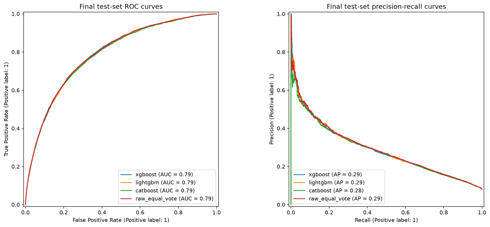
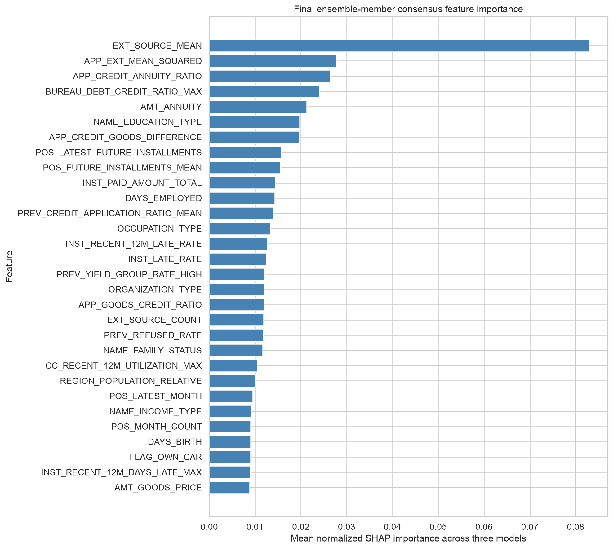
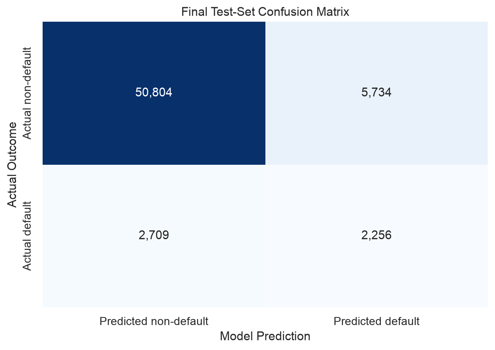

# Explainable Machine Learning for Credit Default Prediction in Retail Banking

Master of Science in Data Science and Analytics — Major Research Project
Toronto Metropolitan University, 2026
**Author:** Taran Veer Singh
**Supervisor:** Dr. Pawel Pralat

## Project overview

This project builds an explainable machine learning system for predicting loan default risk, using the [Home Credit Default Risk dataset](https://www.kaggle.com/c/home-credit-default-risk) (307,511 applicants, 7 linked data files). The pipeline covers data cleaning, feature engineering, model comparison, hyperparameter tuning, ensembling, threshold selection, SHAP-based interpretation, and a fairness audit across gender and age groups.

The final model is an equal-vote ensemble of tuned XGBoost, LightGBM, and CatBoost models.

## Results

| Metric | Training (out-of-fold) | Final test set |
|---|---|---|
| ROC-AUC | 0.7914 | **0.7933** |
| PR-AUC | 0.2857 | **0.2907** |

At the selected decision threshold (0.161991, chosen by maximizing F1-score on training data only):

| Metric | Value |
|---|---|
| Accuracy | 86.27% |
| Precision | 28.24% |
| Recall | 45.44% |
| F1-score | 34.83% |
| Specificity | 89.86% |

The final feature set contains **330 predictors** (318 numerical, 12 categorical) built from all 7 source tables. SHAP analysis shows external credit scores, loan affordability, existing debt, and prior payment behaviour are the strongest drivers of the model's predictions.





## Repository structure

```
notebooks/
├── 01-07_*_eda.ipynb                     Exploratory data analysis (one per source table)
├── 08-14_*_cleaning.ipynb                Data cleaning (one per source table)
├── 15-20_*_feature_engineering.ipynb     Feature engineering (one per source table)
├── 21_final_feature_merge_and_audit.ipynb        Merges all features into one modelling dataset
├── 22_preprocessing_and_baseline_models.ipynb    Logistic regression & random forest baselines
├── 23_full_boosted_tree_comparison.ipynb         XGBoost / LightGBM / CatBoost, default settings
├── 24-26_*_tuning.ipynb                  Individual tuning for each boosted model
├── 27_feature_selection_comparison.ipynb Tests whether a smaller feature set performs better
├── 28_oof_voting_and_stacking.ipynb      Ensemble comparison (voting vs. stacking)
├── 29_raw_ensemble_classification_cutoff.ipynb   Threshold selection
├── 30_final_training_and_test_evaluation.ipynb   Final, one-time test-set evaluation
├── 31_final_model_shap_interpretation.ipynb      Global and local SHAP explanations
├── 32_final_fairness_and_subgroup_check.ipynb    Gender and age fairness audit
├── 33_final_results_and_conclusions.ipynb        Compiles all results/figures for the report

reports/
└── Saved metrics, figures, tables, and the written report(s) for the project
```

## Methodology summary

1. **Exploratory Data Analysis** — each of the 7 source tables (application, bureau, bureau balance, previous applications, instalments, credit card, POS/cash) explored separately before any cleaning.
2. **Cleaning** — invalid values, placeholder codes, rare categories, and high-missingness columns addressed per table, decisions based on training data only.
3. **Feature Engineering** — raw records aggregated into one row per applicant per table, then merged into a single dataset with 331 candidate predictors.
4. **Modelling** — five-fold out-of-fold validation used throughout. Baselines (logistic regression, random forest) compared against tuned XGBoost, LightGBM, and CatBoost. A feature-selection experiment confirmed the full 330-feature set outperforms smaller subsets.
5. **Ensembling** — equal-vote averaging of the three tuned boosted models outperformed both weighted voting and logistic stacking.
6. **Threshold selection** — chosen to maximize F1-score using training out-of-fold predictions only.
7. **Final evaluation** — the test set was used exactly once, after every modelling decision was frozen.
8. **Interpretation** — SHAP used for both global (portfolio-level) and local (individual-applicant) explanations.
9. **Fairness audit** — model performance compared across gender and age groups, even though gender was excluded from training.

## Requirements

See `requirements.txt` for the Python environment used to run these notebooks.

## Notes

- The raw dataset is not included in this repository due to its size; it can be downloaded from the [Kaggle competition page](https://www.kaggle.com/c/home-credit-default-risk).
